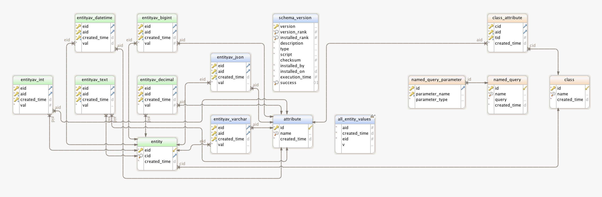

# Grivet 


A micro-service capable of self-service modeling and persistence.


# Motivation

Maintaining and growing a database schema to store and retrieve domain objects is tedious. Yes, there are options like: ORM via JPA, JDO or jOOQ; or document object stores like Couchbase or Mongo.  Without having you jump through too many hoops, `grivet` provides a simple API backed by a RDBMS-based abstraction for type registry, storage and retrieval. 

Make it easy to query types.  E.g., when querying...

* Define a pipe-separated list of constraint keyed parameter values, specified in the form `c=<attribute_name>|<operator>|<value_or_comma_separated_values>|<optional_conjunction>`
* Reference a named query that was (previously) registered plus optional parameter key-value pairs 

to express filtering constraints where constraints are applied on a GET request for a type.


# Sample Workflow

Assuming you've already deployed this service locally...


## Register a type

### Request

```
curl -i -H "Content-Type: application/json" -X POST -d '{ "type": "TestType", "attributes": { "bigint": "bigint", "varchar": "varchar", "decimal": "decimal", "datetime": "datetime", "int": "int", "text": "text", "json": "json" } }' http://localhost:8080/register
```

### Response

```
HTTP/1.1 201 Created
Server: Apache-Coyote/1.1
X-Application-Context: application:h2
Location: /register/TestType
Content-Length: 0
Date: Wed, 29 Jul 2015 13:37:38 GMT
```

## Verify that the type was registered

### Request

```
curl -H "Content-Type: application/json" "http://localhost:8080/register/TestType" | python -mjson.tool
```

### Response

```
  % Total    % Received % Xferd  Average Speed   Time    Time     Time  Current
                                 Dload  Upload   Total   Spent    Left  Speed
100   171  100   171    0     0  11132      0 --:--:-- --:--:-- --:--:-- 11400
{
    "attributes": {
        "bigint": "bigint",
        "datetime": "datetime",
        "decimal": "decimal",
        "int": "int",
        "json": "json",
        "text": "text",
        "varchar": "varchar"
    },
    "description": "",
    "type": "TestType"
}
```

## Check all registered types

### Request

```
curl -H "Content-Type: application/json" "http://localhost:8080/register/" | python -mjson.tool
```

### Response

```
  % Total    % Received % Xferd  Average Speed   Time    Time     Time  Current
                                 Dload  Upload   Total   Spent    Left  Speed
100   308  100   308    0     0  10706      0 --:--:-- --:--:-- --:--:-- 11000
[
    {
        "attributes": {
            "artist": "varchar",
            "label": "varchar",
            "price": "decimal",
            "title": "varchar",
            "year": "int"
        },
        "description": "",
        "type": "Album"
    },
    {
        "attributes": {
            "bigint": "bigint",
            "datetime": "datetime",
            "decimal": "decimal",
            "int": "int",
            "json": "json",
            "text": "text",
            "varchar": "varchar"
        },
        "description": "",
        "type": "TestType"
    }
]
```


## Store a type

### Request

```
curl -i -H "Content-Type: application/json" -X POST -d '{ "artist": "Rush", "year": 1981, "price": 9.99, "label": "Anthem", "title": "Moving Pictures"}' http://localhost:8080/store/Album
```

### Response

```
HTTP/1.1 204 No Content
Server: Apache-Coyote/1.1
X-Application-Context: application:h2
Date: Wed, 29 Jul 2015 14:25:18 GMT
```


## Verify that the type was stored 

In this example request results constrained by `createdTime`

### Request

```
curl -H "Content-Type: application/json" "http://localhost:8080/store/Album" | python -mjson.tool
```

### Response

```
  % Total    % Received % Xferd  Average Speed   Time    Time     Time  Current
                                 Dload  Upload   Total   Spent    Left  Speed
100    87  100    87    0     0   1650      0 --:--:-- --:--:-- --:--:--  1673
[
    {
        "artist": "Rush",
        "label": "Anthem",
        "price": 9.99,
        "title": "Moving Pictures",
        "year": 1981
    }
]
```

# Developer Notes

This is a Spring Boot application.  It is initialized with:

[App.java](https://github.com/fastnsilver/grivet/blob/master/src/main/java/com/fns/grivet/App.java)


## Prerequisites

* Java JDK 1.8.0_45
* Maven 3.3.3
* an RDBMS (H2 is the default w/ no additional configuration); see [application.yml](https://github.com/fastnsilver/grivet/blob/master/src/main/resources/application.yml) for details


## How to build

```
$ mvn clean install
```

## How to run

```
$ mvn spring-boot:run
```

Or

```
$ mvn spring-boot:run -Dspring.profiles.active=<profile-name>
```

where `<profile-name>` could be replaced with `h2` or `mysql`

Or 

```
$ java -jar grivet-x.x.x.war
```

where `x.x.x` is a version like `0.0.1-SNAPSHOT`

Or

```
$ java -jar grivet-x.x.x.war -Dspring.profiles.active=<profile-name>
```

likewise replacing `<profile-name>`


## Supported Types

See [AttributeType.java](https://github.com/fastnsilver/grivet/blob/master/src/main/java/com/fns/grivet/model/AttributeType.java) for supported attribute types


## Endpoints

### Type Registration

* GET `/register/`

returns all registered types

* GET `/register/{type}`

returns the registered type

* PUT `/register/{type}?unlinkSchema`

unlinks existing JSON Schema from a pre-registered type; subsequent `/store/{type}` requests will NOT be validated against schema

* POST `/register`

Sample POST request [TestType.json](https://github.com/fastnsilver/grivet/blob/master/src/test/resources/TestType.json)

* POST `/register?linkSchema`

links a JSON Schema with a pre-registered type; subsequent `/store/{type}` requests will be validated against schema

Sample POST request [TestTypeSchema.json](https://github.com/fastnsilver/grivet/blob/master/src/test/resources/TestTypeSchema.json)


### Type Storage and Retrieval

* POST `/store/{type}`

Sample POST request [TestTypeData.json](https://github.com/fastnsilver/grivet/blob/master/src/test/resources/TestTypeData.json)

* GET `/store/{type}`

returns records that were created within the last 7 days

* GET `/store/{type}?createdTimeStart=yyyy-MM-ddTHH:mm:ss&createdTimeEnd=yyyy-MM-ddTHH:mm:ss`

returns records that were created between `createdTimeStart` and `createdTimeEnd`


#### Named Queries

You may wish to review the ER diagram below to fully leverage this feature.  Currently, you are limited to registering and executing `SELECT` queries and `CALL`ing stored procedures.  

* POST `/query`

Sample POST requests:

* [SELECT](https://github.com/fastnsilver/grivet/blob/master/src/test/resources/TestSelectQuery.json)
* [CALL](https://github.com/fastnsilver/grivet/blob/master/src/test/resources/TestSprocQuery.json)

Consult this [Stored Procedure](https://github.com/fastnsilver/grivet/blob/master/src/test/resources/db/hsqldb/V1_1__add_test_sproc.sql) example for a sample HSQLDB based implementation

* GET `/query?showAll`

returns all named queries; displays: name, type, query, and parameters

* GET `/query/{name}`

executes a named query that does not require parameters

* GET `/query/{name}?<parameter_key1>=<parameter_value1>&<parameter_key2>=<parameter_key2>...`

executes a named query consuming the parameters supplied in request

##### Example

* GET `/query/getAttributesCreatedBefore?createdTime=2015-10-01T00:00:00`

will execute the named query `getAttributesCreatedBefore` consuming the `createdTime` parameter value

Note: in case of calling a stored procedure, the stored procedure must already exist in the database!




#### Dynamic Queries

Dynamic queries are great to get started with, but often you will want more flexibility over query structure.  For those situations look into employing a Named Query.

To retrieve a type by any of its attributes you may specify one or more request parameters for query constraints of the form:

* `<constraint_key>=<attribute_name>|<operator>|<value>|<conjunction>`

where

* `<constraint_key>` may be `c` or `constraint`
* `<attribute_name>` is a registered attribute of the type
* `<operator>` is one of [Operator](https://github.com/fastnsilver/grivet/blob/master/src/main/java/com/fns/grivet/query/Operator.java)
* `value` is (depending upon the `operator`) either a single value or a comma-separated list of values
* `conjunction` is one of [Conjunction](https://github.com/fastnsilver/grivet/blob/master/src/main/java/com/fns/grivet/query/Conjunction.java); this value is optional and if not defined then (for more than one constraint) each constraint is `OR`ed. 

Note: all conjunctions must be homogenously defined!

##### Examples

* GET `/store/TestType?c=datetime|lessThan|2015-07-01T10:00:00`

returns `TestType` records that have attribute `datetime` less than the day constraint value

* GET `/store/TestType?constraint=datetime|lessThan|2015-07-01T10:00:00&constraint=varchar|equals|Rush`

returns `TestType` records that match on either `datetime` `OR` `varchar` attributes and constraint values


# Roadmap

## 0.0.1 

- [x] Basic implementation supporting registration, storage and retrieval of text, numbers, and dates
- [x] Single and batch POST capable /register and /store end-points
- [x] Dynamic query support
- [x] Named query support via /query end-point; both SELECT queries and CALLs to stored procedures
- [x] Link JSON Schema with a registered type; on subsequent store requests for type, type will be validated against schema before attempt to persist
- [ ] Documentation authored and published inc. API, [Javadoc](http://fastnsilver.github.io/grivet/apidocs/index.html), [Maven Site](http://fastnsilver.github.io/grivet/) to Github Pages
- [x] Continuous integration builds configured on [Shippable](http://docs.shippable.com/)

## 0.0.2

- [ ] Introduce OAuth2 security
- [ ] Define roles to limit access to administrators for registering new types and queries
- [ ] All writes are audited (user is associated with record)
- [ ] Improve test coverage
- [ ] Run JMeter tests and publish performance metrics for a) write-intensive and b) read-intensive application

## 0.0.3

- [ ] Implement Vaadin-based administrative UI
- [ ] Docker container (app w/ MySQL back-end)

## Footnote

This project has no desire or aspirations to be on par from a scalability or capability standpoint with Hadoop / Apache Orc, ElasticSearch or SenseiDB. 